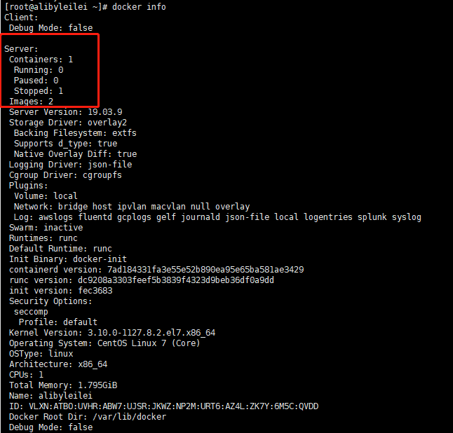
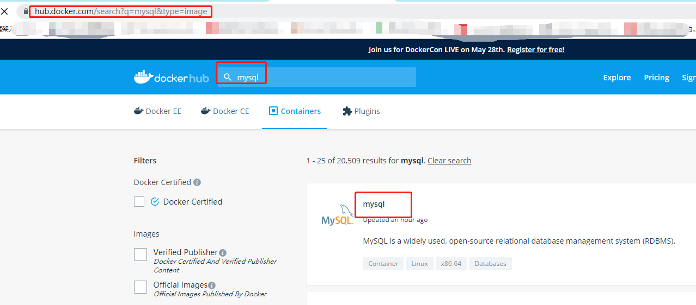
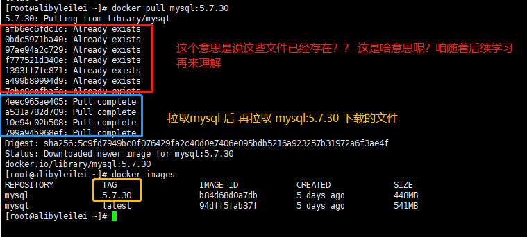
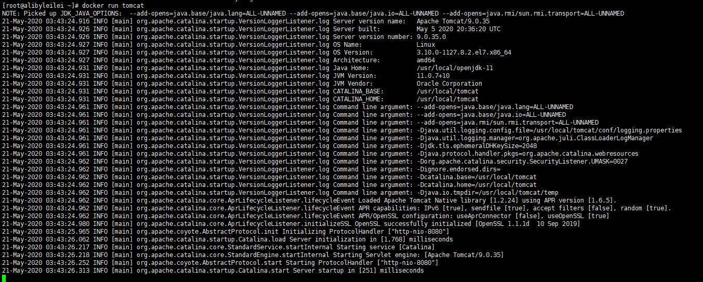
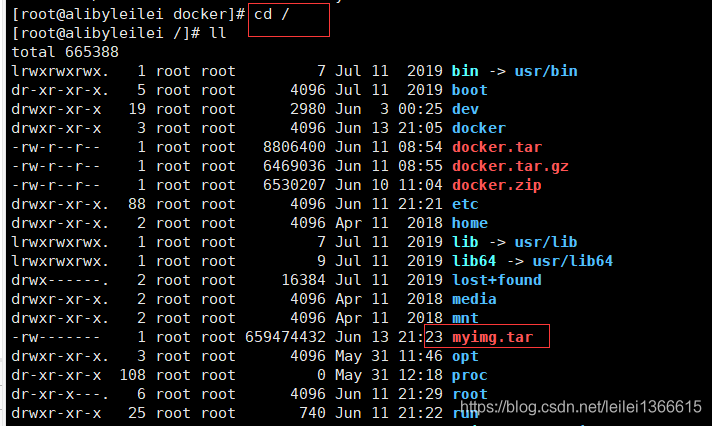
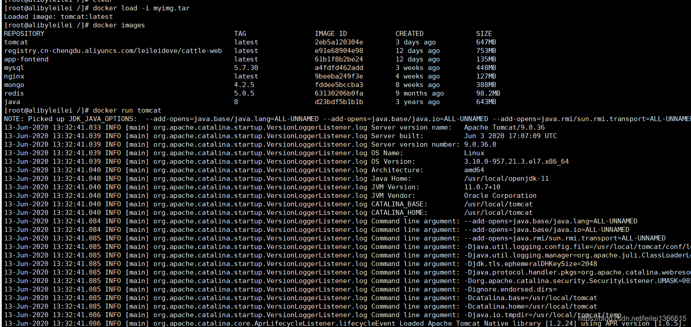
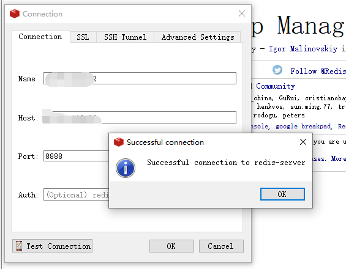
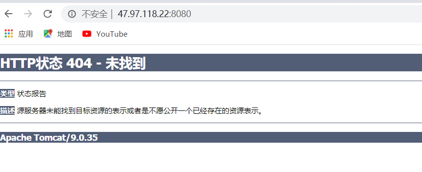

# Docker

### 配置仓库地址

虽然每次安装docker之后都会进行修改仓库地址，但是每次修改之后都记不住在在哪里修改仓库地址，今天我还是来记录一下，省的以后找不到。

步骤只有两步：1、修改配置文件。2、重启docker

1、修改配置文件

编辑配置文件，没有就创建一个

```bash
vim /etc/docker/daemon.json
```

文件内容如下：

```json
{
  "registry-mirrors": [
        "https://dockerhub.azk8s.cn",
        "https://hub-mirror.c.163.com"
    ]
}
```

这里的仓库地址可以写多个

2、重启docker

```bash
systemctl daemon-reload
systemctl restart docker
systemctl status docker
```

查看一下结果 

```bash
docker info
```

```bash
 Registry Mirrors:
  https://dockerhub.azk8s.cn/
  https://hub-mirror.c.163.com/
 Live Restore Enabled: false
```


## （一）基础命令

```bash
# 将当前用户添加到docker组中，可以使该用户不用sudo使用docker
# 将lsh用户追加到docker组中
sudo usermod -aG docker lsh
# 或者gpasswd -a lsh docker

# 重启docker服务
sudo systemctl restart docker

# 重启linux
sudo reboot
```

### 服务启动命令

- **启动docker**

  ```bash
  systemctl start docker
  ```

- **关闭docker**

  ```bash
  systemctl stop docker
  ```

- **重启docker**

  ```bash
  systemctl restart docker
  ```

- **docker设置随服务启动而自启动**

  ```bash
  systemctl enable docker
  ```

- **查看docker 运行状态**
  如果是在运行中 输入命令后 会看到绿色的active

  ```bash
  systemctl status docker
  ```

- **查看docker版本号信息**

  ```bash
  docker version
  docker info
  ```
  
  

### Docker帮助命令

忘记了某些命令便可使用此进行查看与回顾

```bash
docker --help
```

比如 咱忘记了 拉取命令 不知道可以带哪些参数 咱可以这样使用

```bash
docker pull --help
```


## （二）docker 镜像命令

### **查看自己服务器中docker 镜像列表**

```shell
docker images
```

### **搜索镜像**

```shell
docker search 镜像名
docker search --filter=STARS=9000 mysql 搜索 STARS >9000的 mysql 镜像
```

### **拉取镜像** 

- 不加tag(版本号) 即拉取docker仓库中 该镜像的最新版本latest 加:tag 则是拉取指定版本

```shell
docker pull 镜像名 
docker pull 镜像名:tag
```

拉取最新版 mysql


咱再来拉取一个指定版本号 镜像 至于版本号呢 可以在docker hub中查看



例如 拉取 mysql 5.7.30 ------------------这里出现了一些小东西 感觉挺新奇的 随着学习深入再回过头来看吧



### **运行镜像** 

- 咱拉取一个tomcat 跑起来试一试

```shell
docker run 镜像名
docker run 镜像名:Tag
12
```

**ex：**

```shell
docker pull tomcat

docker run tomcat
```



发现咱运行后 出现tomcat 默认占用的8080 端口 说明该镜像已经是启动了 ，但是 咱好像鼠标没有回到咱服务器上了,这怎么办呢？使用 Ctrl+C （注：此方式虽然可以退出容器，但此种命令操作方式却是错误的，详细缘由请见下文的容器命令）docker中 run 命令是十分复杂的 有什么持久运行 映射端口 设置容器别名 数据卷挂载等

<hr>

一通测试，发现我们拉了好多镜像了，但我们现在根本用不着，这些无用镜像怎么删除呢？

### **删除镜像** 

- 当前镜像没有被任何容器使用才可以删除

```bash
#删除一个
docker rmi -f 镜像名/镜像ID

#删除多个 其镜像ID或镜像用用空格隔开即可 
docker rmi -f 镜像名/镜像ID 镜像名/镜像ID 镜像名/镜像ID

#删除全部镜像  -a 意思为显示全部, -q 意思为只显示ID
docker rmi -f $(docker images -aq)
```

### **强制删除镜像**

```shell
docker image rm 镜像名称/镜像ID
```

镜像的基础命令就到这里 下方会使用更复杂的 docker run 命令 来根据镜像启动容器

### **保存镜像**
将我们的镜像 保存为tar 压缩文件 这样方便镜像转移和保存 ,然后 可以在任何一台安装了docker的服务器上 加载这个镜像

命令:

```shell
docker save 镜像名/镜像ID -o 镜像保存在哪个位置与名字
```

exmaple:

```
docker save tomcat -o /myimg.tar
```

**保存镜像任务执行完毕，我们来看下指定位置下是否有该tar？**



### **加载镜像**
任何装 docker 的地方加载镜像保存文件,使其恢复为一个镜像

```shell
docker load -i 镜像保存文件位置
```


**加载文件 恢复为镜像**


**查看镜像 测试镜像功能是否正常**

我们来把解压的镜像 run一下。



镜像标签
有的时候呢，我们需要对一个镜像进行分类或者版本迭代操作，比如我们一个微服务已经打为docker镜像，但是想根据环境进行区分为develop环境与alpha环境，这个时候呢，我们就可以使用Tag，来进对镜像做一个标签添加，从而行进区分；版本迭代逻辑也是一样，根据不同的tag进行区分

```bash
app:1.0.0 基础镜像
分离为开发环境
app:develop-1.0.0   
分离为alpha环境
app:alpha-1.0.0   
```

```bash
docker tag SOURCE_IMAGE[:TAG] TARGET_IMAGE[:TAG]

docker tag 源镜像名:TAG 想要生成新的镜像名:新的TAG

如果省略TAG 则会为镜像默认打上latest TAG
docker tag aaa bbb
上方操作等于 docker tag aaa:latest bbb:test
```

ex:

```bash
我们根据镜像 quay.io/minio/minio 添加一个新的镜像 名为 aaa 标签Tag设置为1.2.3
docker tag quay.io/minio/minio:1.2.3 aaa:1.2.3

我们根据镜像 app-user:1.0.0 添加一个新的镜像 名为 app-user 标签Tag设置为alpha-1.0.0
docker tag app-user:1.0.0 app-user:alpha-1.0.0
```


## （三）docker 容器命令

前言已经说了 docker 容器 就好比 咱java中的new出来对象（docker run 镜像 产生一个该镜像具体容器实例）,docker 容器的启动需要 镜像的支持

先放上 docker 容器查看命令

### **查看正在运行容器列表**

```shell
docker ps
```

### 查看容器的详细信息

- 包括CPU，内存

```bash
docker stats
```

### 查看容器ip

```bash
docker inspect --format='{{.NetworkSettings.IPAddress}}' mysql-master
```

### **查看所有容器** 

- 包含正在运行 和已停止的

```shell
docker ps -a
```

### 文件拷贝

- 从实体机到docker
- docker cp /路径/文件名 容器ID:/上传路径

```bash
# 将1这个文件拷贝到docker的/usr/share目录下
sudo docker cp 1 00e7d0f73704:/usr/share/
```

- 从docker到实体机
- docker cp 容器ID:/上传路径 /路径/文件名

```bash
# 将123.txt拷贝到实体机的/usr/share/目录下
sudo docker cp 00e7d0f73704:/usr/local/arm/rootfs-debian/123.txt /usr/share/
```


**容器怎么来呢 可以通过run 镜像 来构建 自己的容器实例**

### **运行一个容器**

```shell
-it 表示与容器进行交互式启动 
-d 表示可后台运行容器 （守护式运行）  
--name 给要运行的容器起的名字  /bin/bash  交互路径
-v <host_path>:<container_path> <image>：将主机的目录挂载到容器内部。
-p <host_port>:<container_port> <image>：将容器的端口映射到主机的端口。
docker run -it -d --name 要取的别名 镜像名:Tag /bin/bash 
```

例如我们要启动一个redis 把它的别名取为redis001 并交互式运行 需要的命令 —我这里指定版本号为5.0.5

```bash
#1. 拉取redis 镜像
docker pull redis:5.0.5
#2.命令启动
docker run -it -d --name redis001 redis:5.0.5 /bin/bash
```


```bash
#3.查看已运行容器
docker ps
```


发现看到了 redis 使用了6379 端口 那么我们在关闭防火墙或开启了安全组的情况下 是否可以进行访问呢？为了区分咱们使用linux 命令 查看一下

```bash
#netstat是控制台命令,是一个监控TCP/IP网络的非常有用的工具，它可以显示路由表、实际的网络连接以及每一个网络接口设备的状态信息
netstat -untlp
```

<hr>

**这里，来补充一点Docker容器的知识！**

**每一个 Docker容器都是独立和安全的应用平台（我们可以理解为，每一个docker容器都相当于在我们的服务器上占用资源然后开辟了属于自己的一个空间（也可以理解为服务器））**


这是Docker 一大特点，每个容器之间环境都是隔离的!!!

我们甚至可以在一个服务器上，使用docker镜像，来跑出N个 mysql实例（尽管，他们的默认端口都是一样的，但还是那句话，容器间，环境是隔离的。A容器中的3306 与B容器的3306毫无关系，因为其不在一个世界呀!）

默认情况下，我们是无法通过宿主机（安装docker的服务器）端口来直接访问容器的 ,因为docker容器自己开辟空间的端口与宿主机端口没有联系…

如果外部想要访问容器，那必须得让容器中的端口与宿主机的端口建立联系绑定起来，这个正式的概念叫做 容器端口映射

有了端口映射，我们就可以将宿主机端口与 容器端口绑定起来，比如 我们建立宿主机的6379端口与容器redis6379端口绑定起来，那么再访问宿主机Ip:6379 就可以访问到对应容器了！

接下来 进行 容器端口映射演示

首先**停止容器**

```bash
# 先停止咱之前运行的 redis 容器 
docker stop 容器名/容器ID
```


然后**删除容器** -----不经意间 咱发现已经运行过这么多容器了 咱进行清理一下


```bash
#删除一个容器
docker rm -f 容器名/容器ID
#删除多个容器 空格隔开要删除的容器名或容器ID
docker rm -f 容器名/容器ID 容器名/容器ID 容器名/容器ID
#删除全部容器
docker rm -f $(docker ps -aq)
```


这样 容器就已经删除完毕了 ，咱们接着弄 前边说的 端口映射

**容器端口与服务器端口映射**

```bash
-p 宿主机端口:容器端口
```

还是使用前方的 redis 镜像 尝试 将6379端口 映射到服务器的8888 如果成功了的话 那么咱们访问服务器的8888端口就会访问到咱们的 docker 中 的容器 redis002

-p 8888:6379 解析 将容器内部的 6379端口与docker 宿主机（docker装在哪台服务器 哪台服务器就是宿主机）8888 端口进行映射 那通过外部访问宿主机8888端口 即可访问到 docker 容器 6379 端口了

```bash
docker run -itd --name redis002 -p 8888:6379 redis:5.0.5 /bin/bash
```


在运行后 发现服务器的 8888 端口显示已被docker-proxy 所占用了 那么此时咱再用工具进行连接测试呢？



**那么容器端口映射有没有什么限制呢？**

有的，虽说每个容器之间，环境都是隔离的，但是宿主机每个端口都是一个，8888端口被redis002容器绑定了，那么其他所有的容器都不可以使用8888这个端口了!!!

<hr>

有时候，我们需要进入容器内部，修改其配置文件，那么如何才能进入容器内呢？

### **进入容器方式**

- docker exec

```bash
docker exec -it 容器名/容器ID /bin/bash

#进入 前面的 redis001容器   
docker exec -it redis001 /bin/bash
```


可以看到 我已经从主机alibyleilei 跳到了容器ID 对应下的 /data 已经是进入到容器内部了

- docker attach 容器名/容器ID

那怎么退出容器呢 ？

**从容器内 退出到自己服务器中** 需注意 两个退出命令的区别

```bash
#-----直接退出  未添加 -d(持久化运行容器) 时 执行此参数 容器会被关闭  
exit

#优雅退出 --- 无论是否添加-d 参数 执行此命令容器都不会被关闭
Ctrl + p + q
```

**停止容器**

```shell
docker stop 容器ID/容器名
```

**重启容器**

```shell
docker restart 容器ID/容器名
```

**启动容器**

```shell
docker start 容器ID/容器名
```

**kill 容器**

```shell
docker kill 容器ID/容器名
```

**删除容器**

```bash
docker rm 容器ID/容器名
```


**容器文件拷贝** —无论容器是否开启 都可以进行拷贝

```bash
#docker cp 容器ID/名称:文件路径  要拷贝到外部的路径   |     要拷贝到外部的路径  容器ID/名称:文件路径
#从容器内 拷出
docker cp 容器ID/名称: 容器内路径  容器外路径
#从外部 拷贝文件到容器内
docker cp 容器外路径 容器ID/名称: 容器内路径
```

**查看容器日志**

```bash
docker logs -f --tail=要查看末尾多少行 默认all 容器ID
```


我们在运维的时候，通常给一些软件喜欢设置开机自启动，例如 mysql、redis,这样测试环境服务器重启时可节省不少运维时间成本，那么我们如果是docker容器 是否也可以设置开机自启动容器呢？

答案是 OKKKKK!

启动容器时，使用docker run命令时 添加参数--restart=always 便表示，该容器随docker服务启动而自动启动ex:

```shell
docker run -itd --name redis002 -p 8888:6379 --restart=always  redis:5.0.5 /bin/bash
```

这个时候有小伙伴着急了，我都已经启动一个容器好久了，跑了很多数据了，现在才告诉我可以设置自启动？我把容器删了再启动，我数据咋办？？？

哎！小伙汁，这个时候不要慌，我告诉你两个办法！

方法一：担心数据丢了，这说明你在跑容器的时候没有进行数据挂载吧？？？

你问我，什么是数据挂载？

简单来讲，就是将容器内的数据与外部宿主机文件绑定起来，类似一个双持久化，当容器删除时，宿主机文件数据目录仍在，下次启动容器只要将数据目录指向宿主机数据所在位置即可恢复！
具体请参考：[docker 文件分层与数据卷挂载](https://blog.csdn.net/leilei1366615/article/details/106269231)

命令:

```shell
-v 宿主机文件存储位置:容器内文件位置
```

如此操作，就将 容器内指定文件挂载到了宿主机对应位置，-v命令可以多次使用，即一个容器可以同时挂载多个文件

```shell
-v 宿主机文件存储位置:容器内文件位置 -v 宿主机文件存储位置:容器内文件位置 -v 宿主机文件存储位置:容器内文件位置
```

示例：

```bash
# 运行一个docker redis 容器 进行 端口映射 两个数据卷挂载 设置开机自启动
docker run -d -p 6379:6379 --name redis505 --restart=always  -v /var/lib/redis/data/:/data -v /var/lib/redis/conf/:/usr/local/etc/redis/redis.conf  redis:5.0.5 --requirepass "password"
```

**此方法完了你很无语？那还不是得删容器？是呀！没错！那么为什么你有数据恢复需求而没有想到数据持久化，数据恢复备份，数据卷挂载？自己DEMO的吃亏，是为了平时开发少扣脑壳多摸鱼！**

**方法二：不想删容器，又想让这个容器设置开机自启动，那么我们修改其启动配置即可！**

命令:

```shell
docker  update --restart=always 容器Id 或者 容器名
或
docker container update --restart=always 容器Id 或者 容器名
```

如上，虽然不删容器就设置了自启动需求满足了，但是，危不危险，这个容器有没有需要数据恢复的情况？自己考量吧！！！

**更换容器名**

想给容器换个霸气炫酷吊炸天的名字？

```shell
docker rename 容器ID/容器名 新容器名
```

**ex:**


## (四）自己提交一个镜像

我们运行的容器可能在镜像的基础上做了一些修改，有时候我们希望保存起来，封装成一个更新的镜像，这时候我们就需要使用 commit 命令来构建一个新的镜像

```shell
docker commit -m="提交信息" -a="作者信息" 容器名/容器ID 提交后的镜像名:Tag
```

我们拉取一个tomcat镜像 并持久化运行 且设置与宿主机进行端口映射

```shell
docker pull tomcat

docker run -itd -p8080:8080 --name tom tomcat /bin/bash
```

访问 咱的端口 发现访问404 这是因为咱配置了阿里云镜像后 所拉取得镜像都是最基础班的 仅仅包含其容器必要数据 例如 容器中 vim vi ll 命令都没有




咱们的webapps 下一个文件都没有 ，访问肯定404罗

不断查看 发现咱 webapps.dist 下是有文件的 我们把它拷贝的webapps 下 然后打包成一个新的镜像 后 访问查看是否进入到首页 不进入404页面


exit 退出容器

使用 提交命令 将在运行的tomcat 容器 打包为一个全新的镜像 名字为tom Tag为1.0

```
docker commit -a="leilei" -m="第一次打包镜像，打包后直接访问还会404吗" 231f2eae6896 tom:1.0
```


为了区分 咱停止并删除之前tomcat 的容器


接下来 运行咱自己打包的镜像 tom:1.0

设置容器名字为lei 映射端口为6500:8080

```shell
docker run -d -it  -p6500:8080 --name lei tom:1.0 /bin/bash
```


访问6500 端口进入到了 tomcat 首页 说明 咱commit 镜像成功了

## (五)docker 运维命令

可能有时候发布会遇到如下错误:

```
docker: write /var/lib/docker/tmp/GetImageBlob325372670: no space left on device
```

这个错误是docker在写入的时候报错无机器无空间


**查看docker工作目录**

```shell
sudo docker info | grep "Docker Root Dir"
```


### **查看docker磁盘占用总体情况**

```shell
du -hs /var/lib/docker/ 
```

### **查看Docker的磁盘使用具体情况**

```shell
docker system df
```


### **删除 无用的容器和 镜像**

```bash
# 删除异常停止的容器
docker rm `docker ps -a | grep Exited | awk '{print $1}'` 
 
# 删除名称或标签为none的镜像
docker rmi -f  `docker images | grep '<none>' | awk '{print $3}'`
```

### **清除所有无容器使用的镜像**

注意，此命令只要是镜像无容器使用（容器正常运行）都会被删除，包括容器临时停止

```bash
docker system prune -a
```

### **查找大文件**

```bash
find / -type f -size +100M -print0 | xargs -0 du -h | sort -nr
```

### **查找指定docker使用目录下大于指定大小文件**

```bash
find / -type f -size +100M -print0 | xargs -0 du -h | sort -nr |grep '/var/lib/docker/overlay2/*'
```

ex：我这里是查找 /var/lib/docker/overlay2/* 开头的且大于100m的文件


